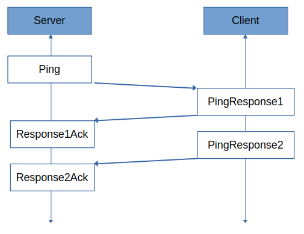
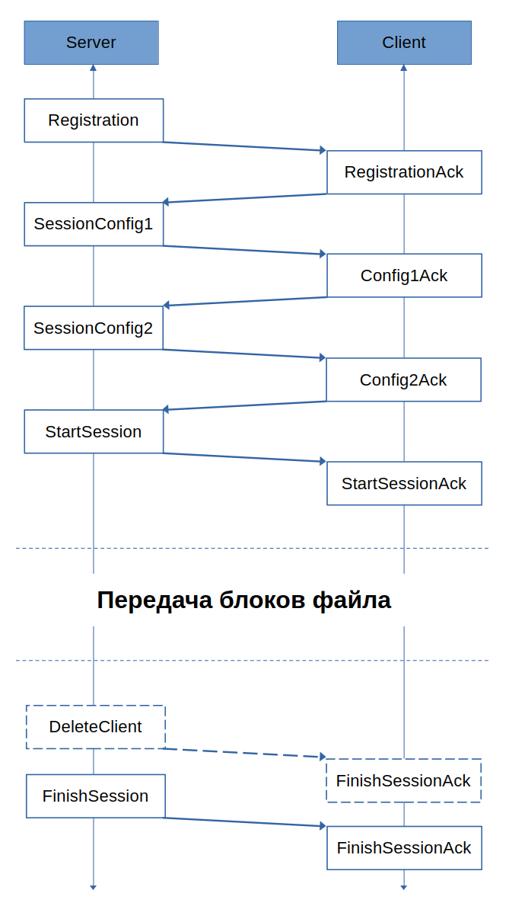
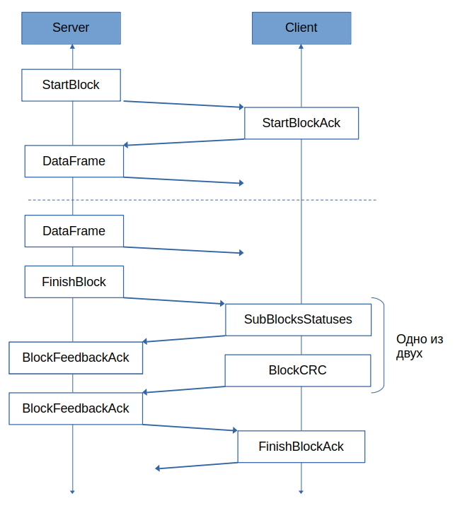

# CANFileTransferProtocol

## Описание протокола

**CANFileTransferProtocol** - протокол прикладного уровня, построенный на базе CAN-протокола, предназначенный для передачи файлов. Протокол предполагает наличия одного ведущего (источника файлов, сервера) и произвольного  числа ведомых (приемников файлов, клиентов). Передача файлов осуществляется поблочно (фрагментами файла) с верификацией получения блока каждым из клиентов. В случае возникновения ошибок передачи, сессия передачи файла будет продолжена для оставшихся в сессии клиентов.

## Концептуальные особенности протокола

- Максимальное количество одновременных сессий передачи файлов - 256.
- Максимальное число участиков сессии (клиентов) - 256.
- Максимальный размер передаваемого блока файла - 2048 байт.
- Максимальный размер файла - 2^32 байт.

 > **Примечание.** Представленные значения являются алгоритмическими, фактические ограничения зависят от технических характеристик аппаратных средств и от пропускной способности CAN-шины. 

## Составные части протокола и их описания

### Этап Ping



#### Описание этапа

1) При первоначальном поиске устройств (клиентов), реализующих описываемый протокол, происходит циклическая отправка сообщений **Ping**, на которые клиенты отвечают группами сообщений **PingResponse**, передающими описание устройства.

2) В случае, если сервер ответил подтверждениями (**ResponseAck**) на все сообщения **PingResponse**, клиент прекращают отвечать на сообщение **Ping**.

3) Для блокировки логики клиента (кроме протокола) необходимо отправить сообщение **Ping** с флагом **TERMINATE**, для включения логики - с флагом **RELEASE**; стоит отметить, что отправка данного сообщения с флагом **RELEASE** автиматически прекратит работу активной сессии передачи файла.

> **Примечание**. Сообщения ответов со стороны клиентов передаются со случайным периодом в заданном диапазоне.

#### Сообщения этапа
---
> **Ping**

**Отправитель:** Server.

**Размер:** 8 байт.

**Идентификатор:** 0x00010000.

|Название поля|Позиция|Размер|Описание|
|-------------|-------|------|--------|
|ProtocolVersion|0|16|Версия протокола|
|TerminationRequest|16|2|Тип запроса блокировки логики|

---
> **ResponseAck**

**Отправитель:** Server.

**Размер:** 8 байт.

**Идентификатор:** 0x00020000.

|Название поля|Позиция|Размер|Описание|
|-------------|-------|------|--------|
|ResponseType|0|4|Тип сообщения описания устройства, которое подтверждает сервер|
|DeviceSerial|4|32|Серийный номер устройства, отправившего сообщение описания|

---
> **PingResponse1**

**Отправитель:** Client.

**Размер:** 8 байт.

**Идентификатор:** 0x0009**DDDD**, где DDDD - код устройства, полученный из серийного номера.

|Название поля|Позиция|Размер|Описание|
|-------------|-------|------|--------|
|ResponseType|0|4|Тип сообщения описания устройства (индекс)|
|DeviceSerial|4|32|Серийный номер устройства|
|DeviceId|36|8|Идентификатор устройства|
|DeviceSerial|44|20|Тип устройства|

---
> **PingResponse2**

**Отправитель:** Client.

**Размер:** 8 байт.

**Идентификатор:** 0x0009**DDDD**, где DDDD - код устройства, полученный из серийного номера.

|Название поля|Позиция|Размер|Описание|
|-------------|-------|------|--------|
|ResponseType|0|4|Тип сообщения описания устройства (индекс)|
|DeviceSerial|4|32|Серийный номер устройства|
|SoftwareVersion.Low|36|8|Версия программного обеспечения (младшая часть)|
|SoftwareVersion.Middle|44|8|Версия программного обеспечения (средняя часть)|
|SoftwareVersion.High|52|8|Версия программного обеспечения (старшая часть)|

---
#### Типы сообщений 

- RESPONSE1 = 0
- RESPONSE2 = 1

### Этап управления сессией передачи файла



#### Описание этапа

1) Сообщение **Registration** (обезличенное) сообщает клиенту код сессии и его код в рамках сессии передачи файла.

2) Остальные Сообщения этапа **Session** передаются уже с привязкой к конкретному коду сессии.

3) Сообщение **SessionConfig** передает клиентам необходимую информацию для реализации сессии.

4) Сообщение **StartSession** оповещает клиентов о готовности начать последовательность блоков файла.

4) Сообщение **FinishSession** сообщает клиентам, что сессия завршена. В случае аварийной терминации сессии в произвольный момент времени также отправляется сообщение **FinishSession**. Данное сообщение содержит статус сессии, который сообщает об успешности ее завершения, или тип возникшей ошибки.

5) Сообщение **DeleteClient** отправляется в случае возникновения ошибки с клиента во время сессии, чтобы освободить его, в то время как сессия будет продолжена для оставшихся клиентов. Данное сообщение является опциональным.

#### Сообщения этапа
---
> **Registration**

**Отправитель:** Server.

**Размер:** 8 байт.

**Идентификатор:** 0x00030000.

|Название поля|Позиция|Размер|Описание|
|-------------|-------|------|--------|
|DeviceSerial|0|32|Серийный номер клиента|
|SessionCode|32|8|Код сессии|
|DeviceCode|40|8|Код клиента в рамках сессии|

---
> **SessionConfig**

**Отправитель:** Server.

**Размер:** 8 байт.

**Идентификатор:** 0x0004**SS**00, где SS - код сессии.

|Название поля|Позиция|Размер|Описание|
|-------------|-------|------|--------|
|MessageType|0|4|Тип сообщения|
|PageIndex|4|8| Индекс страницы записи|
|FileLength|12|32|Длина передаваемогого файла|
|RepeateAckCount|44|8|Количество итераций отправки сообщений подтверждения|
|RepeateInterval|52|12|Интервал времени отправки сообщений подтверждения|

---
> **StartSession**

**Отправитель:** Server.

**Размер:** 8 байт.

**Идентификатор:** 0x0004**SS**00, где SS - код сессии.

|Название поля|Позиция|Размер|Описание|
|-------------|-------|------|--------|
|MessageType|0|4|Тип сообщения|

---
> **FinishSession**

**Отправитель:** Server.

**Размер:** 8 байт.

**Идентификатор:** 0x0004**SS**00, где SS - код сессии.

|Название поля|Позиция|Размер|Описание|
|-------------|-------|------|--------|
|MessageType|0|4|Тип сообщения|
|SessionStatus|4|8|Статус сессии|
|SoftwareVersion.Low|12|8|Версия программного обеспечения (младшая часть)|
|SoftwareVersion.Middle|20|8|Версия программного обеспечения (средняя часть)|
|SoftwareVersion.High|28|8|Версия программного обеспечения (старшая часть)|

---
> **DeleteClient**

**Отправитель:** Server.

**Размер:** 8 байт.

**Идентификатор:** 0x0004**SS**00, где SS - код сессии.

|Название поля|Позиция|Размер|Описание|
|-------------|-------|------|--------|
|MessageType|0|4|Тип сообщения|
|SessionStatus|4|8|Статус сессии|
|DeviceCode|12|8|Код устройства в рамках сессии|

---
> **RegistrationAck**

**Отправитель:** Client.

**Размер:** 3 байт.

**Идентификатор:** 0x000B**SSDD**, где SS - код сессии, DD - код устройства.

|Название поля|Позиция|Размер|Описание|
|-------------|-------|------|--------|
|MessageType|0|4|Тип сообщения|
|Status|4|4|Статус операции|

---
> **ConfigAck**

**Отправитель:** Client.

**Размер:** 3 байт.

**Идентификатор:** 0x000B**SSDD**, где SS - код сессии, DD - код устройства.

|Название поля|Позиция|Размер|Описание|
|-------------|-------|------|--------|
|MessageType|0|4|Тип сообщения|
|Status|4|4|Статус операции|
|MaxBlockLength|8|12|Максимальная длина блока файла|

---
> **StartSessionAck**

**Отправитель:** Client.

**Размер:** 3 байт.

**Идентификатор:** 0x000B**SSDD**, где SS - код сессии, DD - код устройства.

|Название поля|Позиция|Размер|Описание|
|-------------|-------|------|--------|
|MessageType|0|4|Тип сообщения|
|Status|4|4|Статус операции|

---
> **FinishSessionAck**

**Отправитель:** Client.

**Размер:** 3 байт.

**Идентификатор:** 0x000B**SSDD**, где SS - код сессии, DD - код устройства.

|Название поля|Позиция|Размер|Описание|
|-------------|-------|------|--------|
|MessageType|0|4|Тип сообщения|
|Status|4|4|Статус операции|
|SessionStatus|8|8|Статус сессии|

---
#### Типы сообщений со стороны сервера

- CONFIGURATION = 0
- START = 1
- FINISH = 2
- DELETECLIENT = 3

---
#### Типы сообщений со стороны клиента

- REGISTRATIONACK = 0
- CONFIGURATIONACK = 1
- STARTSESSIONACK = 2
- FINISHSESSIONACK = 3

---
#### Статусы операции

- SUCCESS = 0
- FAIL = 1

---
#### Статусы сессии

- OK = 0 : Нормальное состояние сессии.
- ERROR_LOGICISNOTLOCKED = 1 : Ошибка. Логика работы устройства не была заблокирована.
- ERROR_ALRAMTERMINATED = 2 : Ошибка. Сессия была преждевременно выключена.
- ERROR_WRONGSEQUENCE = 3 : Ошибка. Нарущена последовательность протокола.
- ERROR_LOSTCONNECTION = 4 : Ошибка. Потеряна связь.
- ERROR_ACKCOUNTOVERCOME = 5 : Ошибка. Превышено количество итераций ответа серверу.
- ERROR_CONFIGURATIONFAILED = 6 : Ошибка. Невозможно сконфигурировать сессию.
- ERROR_BLOCKSEQUENCEFAILED = 7 : Ошибка. Нарушена последовательность блоков.
- ERROR_BLOCKUNFINISHED = 8 : Ошибка. Не была завершена обработка блока.
- ERROR_FILEUNFINISHED = 9 : Ошибка. Не был передан весь файл.
- ERROR_NOCLIENTSLEFT = 10 : Ошибка. Не осталось ни одного клиента.
- ERROR_REQUESTSSENDINGOVERCOME = 11 : Ошибка. Превышено количество отправляемых запросов.
- ERROR_REGISTRATIONFAILED = 12 : Ошибка. Ошибка регистрации клиента.
- ERROR_SESSIONSTARTINGFAILED = 13 : Ошибка. Ошибка начала сессии.
- ERROR_SESSIONFINISHINGFAILED = 14 : Ошибка. Ошибка окончания сессии.
- ERROR_BLOCKSENDINGOVERCOME = 15 : Ошибка. Превышено количество попыток отправки блока.
- ERROR_BLOCKSTARTINGFAILED = 16 : Ошибка. Ошибка начала чтения блока.
- ERROR_BLOCKFINISHINFFAILED = 17 : Ошибка. Ошибка окончания чтения блока.

### Этап управления передачей блока файла



#### Описание этапа

1) Сообщение **StartBlock** оповещает всех участников сессии о начале передачи блока, и сообщает индекс и размер передаваемого блока.

2) Сообщения **DataFrame** содержат фрагменты блока из 8 байт (до 256 сообщений).

3) Сообщения **FinishBlock** оповещает об окончании передачи блока.

4) В случае, если на стороне клиента был получен не весь блок, им высылается сообщение **SubBlocksStatuses**, которое содержит флаги получения субблоков (группы по 4 **DataFrame**), в случае, если все **DataFrame** были получены, отправляется сообщение **BlockCRC**.

5) Если на стороне сервера было получено сообщение **SubBlocksStatuses**, то после отправки сообщения **FinishBlockAck**, будет осуществлена повторная отправка “пропущенных” субблоков; в случае, если было получено сообщение **BlockCRC**, и контрольные суммы не совпали, то будет повторно отправлен весь блок. В обоих случаях сервер отвечает сообщением **BlockFeedbackAck**.

6) Сообщение **FinishBlockAck** необходимо для подтверждения звершения процесса обработки блока на стороне клинета (например, загрузки во Flash-память).

7) Если все клинеты выслали корректные CRC-суммы и были подтверждено получения всех субблоков, происходит отправка следующего блока, в противном случае, происходит отправка недоставющих фрагментов предыдущего блока, или всего блока целиком.

#### Сообщения этапа

---
> **StartBlock**

**Отправитель:** Server.

**Размер:** 8 байт.

**Идентификатор:** 0x0005**SS**00, где SS - код сессии.

|Название поля|Позиция|Размер|Описание|
|-------------|-------|------|--------|
|MessageType|0|4|Тип сообщения|
|BlockIndex|4|32|Индекс блока|
|BlockILength|36|12|Длина блока|

---
> **FinishBlock**

**Отправитель:** Server.

**Размер:** 8 байт.

**Идентификатор:** 0x0005**SS**00, где SS - код сессии.

|Название поля|Позиция|Размер|Описание|
|-------------|-------|------|--------|
|MessageType|0|4|Тип сообщения|
|BlockIndex|4|32|Индекс блока|

---
> **BlockFeedbackAck**

**Отправитель:** Server.

**Размер:** 8 байт.

**Идентификатор:** 0x0005**SS**00, где SS - код сессии.

|Название поля|Позиция|Размер|Описание|
|-------------|-------|------|--------|
|MessageType|0|4|Тип сообщения|
|DeviceCode|4|8|Код клиента в сессии|
|BlockStatus|12|4|Статус обработки блока|

---
> **DataFrame**

**Отправитель:** Server.

**Размер:** 8 байт.

**Идентификатор:** 0x0006**SSFF**, где SS - код сессии, FF - индекс фрейма.

|Название поля|Позиция|Размер|Описание|
|-------------|-------|------|--------|
|Data|0|64|Последовательность из 8 байт|

---
> **StartBockAck**

**Отправитель:** Client.

**Размер:** 3 байт.

**Идентификатор:** 0x00C**SSDD**, где SS - код сессии, DD - код устройства.

|Название поля|Позиция|Размер|Описание|
|-------------|-------|------|--------|
|MessageType|0|4|Тип сообщения|

---
> **FinishBlockAck**

**Отправитель:** Client.

**Размер:** 3 байт.

**Идентификатор:** 0x00C**SSDD**, где SS - код сессии, DD - код устройства.

|Название поля|Позиция|Размер|Описание|
|-------------|-------|------|--------|
|MessageType|0|4|Тип сообщения|
|BlockStatus|4|4|Статус обработки блока|

---
> **SubBlocksStatuses**

**Отправитель:** Client.

**Размер:** 8 байт.

**Идентификатор:** 0x00D**SSDD**, где SS - код сессии, DD - код устройства.

|Название поля|Позиция|Размер|Описание|
|-------------|-------|------|--------|
|SubBlock1Flag|0|1|Статус получения субблока 1|
|SubBlock2Flag|1|1|Статус получения субблока 2|
|-///-|-///-|-///-|-///-|
|SubBlock64Flag|1|1|Статус получения субблока 64|

---
> **BlockCRC**

**Отправитель:** Client.

**Размер:** 8 байт.

**Идентификатор:** 0x00D**SSDD**, где SS - код сессии, DD - код устройства.

|Название поля|Позиция|Размер|Описание|
|-------------|-------|------|--------|
|CRC|0|64|Последовательность из 8 байт|

---
#### Типы сообщений со стороны сервера

- START = 0
- FINISH = 1
- FEEDBACKACK = 2

---
#### Типы сообщений со стороны клиента

- START = 0
- FINISH = 1

---
#### Статусы обработки блока

- BLOCKISRECIEVED = 0 : Блок принят.
- SUBBLOCKESMISSING = 1 : Часть субблоков не принято.
- BLOCKREPEAT = 2 : Повторная отправка блока.
- FAILED = 3 : Ошибка обработки блока.

## Программная реализация протокола

В данном проекте приводится реализация изложенного протокола в виде независимой библиотеки, написанной на языке **C**, использующая механизмы обработных вызовов и функционального API для обеспечения сопряжение со внешней логикой.

Было реализовано 5 абстратных сущностей:

- **CanFTP_Client_t** - клиент на стороне конечного устройства-участника.

- **CanFTP_Server_t** - сервер, реализующий логику поиска устройств-клиентов для осуществления передачи файлов. 

- **CanFTP_Server_Client_t** - клиент на стороне сервера, являющийся проекцией физического устройства.

- **CanFTP_Server_Session_t** - сессия передачи файла устройствам-клиентам.

- **CanFTP_Server_Session_Client_t** - клиент сессии на стороне сервера.

Стоит отдельно отметить, что при передаче файла обработка осуществляется исключительно поблочно, таким образом, на стороне сервера при необходимости передачи нового блока файла происходит обратный вызов для его инициализации, а на стороне клиента - возникает событие получения нового блока с целью его последующей обработки, иными словами, библиотека не производит хранение всего файла целиком ни на стороне клиента, ни на стороне сервара, перекладывая данную задачу вышестоящей логике.

Для обеспечения корректной роботы логики библиотеки необходимо провести инициализацию функции получения текущего времени, время измеряется в **мс**.

```C
uint32_t GetTimeMark()
{
    return currentTime;
}

CanFTP_TimeHandlers_InitCurrentTimeGetter(GetTimeMark);
```

Также, библиотека отслеживает собственное аномальное поведение, для обеспечения его остлеживания можно произвести инициализацию соответсвующего обработчика.

```C
void ErrorHandle(uint32_t errorCode)
{
    // Какая-то реализация обработчика
}

CanFTP_InitErrorHandler(ErrorHandle);
```

Для реализации логик соответсвующих абстракций необходимо циклически вызывать функции **Invoke**.

### CanFTP_Client_t

> Включение ```#include "CanFTP_Client.h"```

#### Функциональное API

> Для детального ознакомления см. файл CanFTP_Client.h.

|Имя функции|Описание|
|-----------|--------|
|CanFTP_Client_Init|Инициализация клиента|
|CanFTP_Client_Invoke|Вызов логики обработки клиента|
|CanFTP_Client_RecieveCanMessage|Обработка получения сообщений|
|CanFTP_Client_InitRanmod|Проинициализировать функцию генерации случайных значений|
|CanFTP_Client_TerminateSession|Принудительно остановить сессию|
|CanFTP_Client_LockLogic|Заблокировать логику|
|CanFTP_Client_UnlockLogic|Разблокировать логику|
|CanFTP_Client_CheckIsPinging|Проверить, находится ли клиент в состоянии Ping|
|CanFTP_Client_CheckIsInSession|Проверить, находится ли клиент сотоянии активной сессии|

#### Обратные вызовы

> Связывание осуществляется с помощью композиционно включенной структуры callbacks: client.callbacks.

> Для детального ознакомления см. файл CanFTP_Client_Defines.h.

|Имя обратного вызова|Описание|
|--------------------|--------|
|callbacks.sendMessageCallback|Обратный вызов отправки сообщений|
|callbacks.lockLogicRequestCallback|Обратный вызов запроса на блокировку логики (0 - не заблокирована, 1 - заблокирована)|
|callbacks.unlockLogicRequestCallback|Обратный вызов запроса на разблокировку логики (0 - не разблокирована, 1 - разблокирована)|
|callbacks.sessionConfigureationCallback|Обратный вызов конфигурации сессии (0 - сессия не прошла валидацию, 1 - сессия прошла валидацию)|
|callbacks.blockRecieceCallback|Обратный вызов успешного приема блока файла|
|callbacks.sessionFinishedCallback|Обратный вызов завершения сессии|

> **Примечание.** При отсуствии инициализации обратных вызовов **lockLogicRequestCallback**, **unlockLogicRequestCallback**, **sessionConfigureationCallback** они считаются по умолчанию успешными.

> **Примечание.** Обратный вызов **sessionConfigureationCallback** предполагает проверку возможности передачи файла заданного размера и подготовку устройства к приему файла.

#### Параметры управления и конфигурации

> Для детального ознакомления см. файл CanFTP_Client_Defines.h.

|Имя параметра|Описание|
|-------------|--------|
|deviceConfig.serialNumber|Серийный номер устройства|
|deviceConfig.identifier|Идентификатор устройства|
|deviceConfig.type|Тип устройства|
|deviceConfig.softVersion.lowerPart|Младшая часть версии|
|deviceConfig.softVersion.middlePart|Средняя часть версии|
|deviceConfig.softVersion.higherPart|Страршая часть версии|
|control.pingPermition|Разрешенеи на переход в состояние Ping|
|control.sessionStartPermition|Разрешение на активацию сессии|
|control.autpUpdateSoftVersion|Автоматически обновить номер версии при успешном завершении сессии|

### CanFTP_Server_t

> Включение ```#include "CanFTP_Server.h"```

#### Функциональное API

> Для детального ознакомления см. файл CanFTP_Server.h.

|Имя функции|Описание|
|-----------|--------|
|CanFTP_Server_Init|Инициализация сервера|
|CanFTP_Server_Invoke|Вызов логики обработки клиента|
|CanFTP_Server_RecieveCanMessage|Обработка получения сообщений|
|CanFTP_Server_StartPing|Запустить процесс Ping|
|CanFTP_Server_StartRelease|Запустить процесс разблокировки логик клиентов|
|CanFTP_Server_StopPing|Остановить процесс Ping|
|CanFTP_Server_GetClientsCount|Получить количество клиентов|
|CanFTP_Server_GetClientByIndex|Получить клиента по индексу|
|CanFTP_Server_CreateNewSession|Создать экземпляр сессии|
|CanFTP_Server_GetActiveSessionsCount|Получить количество активных сессий|
|CanFTP_Server_GetActiveSessionByIndex|Получить активную сессию по иднексу|

> **Примечание.** После начала поиска устройств (**CanFTP_Server_StartPing**) или их освобождения (**CanFTP_Server_StartRelease**) необходимо вызвать **CanFTP_Server_StopPing**, чтобы остановить процесс. 

> **Примечание.** Все обратные вызовы сессий и их клиентов, как и обработка получаемых сообщений, осуществляется через сервер. 

#### Обратные вызовы

> Связывание осуществляется с помощью композиционно включенной структуры callbacks: server.callbacks.

> Для детального ознакомления см. файл CanFTP_Server_Defines.h.

|Имя обратного вызова|Описание|
|--------------------|--------|
|callbacks.sendMessageCallback|Обратный вызов отправки сообщений|
|callbacks.clientFoundCallback|Событие находления клиента|
|callbacks.sessionFinishedCallback|Обратный вызов события завершения сессии|
|callbacks.getFileBlockCallback|Обратный вызов запроса блока файла|
|callbacks.clientReleaseCallback|Обратный вызов особождения клиента из сессии|

#### Параметры управления и конфигурации

> Для детального ознакомления см. файл CanFTP_Server_Defines.h.

|Имя параметра|Описание|
|-------------|--------|
|controls.doesServerInvokeSessions|Флаг управления вызовом сессий из сервера|
|defaultSessionConfiguration.registrationInterval|Интервалы времени отправки сообщений при регистрации клиентов|
|defaultSessionConfiguration.registrationRepeateCount|Количество повторений отправки сообщений при регистрации клиентов|
|defaultSessionConfiguration.sessionControlInterval|Интервалы времени отправки сообщений при управлении сессией|
|defaultSessionConfiguration.sessionControlRepeateCount|Количество повторений отправки сообщений при управлении сессей|
|defaultSessionConfiguration.repeateBlockCount|Количество повторений отправки блока|
|defaultSessionConfiguration.blockControlInterval|Интервалы времени отправки сообщений при управлении процессом отправки блока|
|defaultSessionConfiguration.blockControlRepeateCount|Количество повторений отправки сообщений при управлении процессом отправки блока|
|defaultSessionConfiguration.frameSendingInterval|Интервалы времени отправки кадров блока|
|defaultSessionConfiguration.repeateAckInterval|Интервалы времени отправки подтверждений со стороны клиента|
|defaultSessionConfiguration.repeateAckCount|Количество повторений отправки сообщений от клиентов|

### CanFTP_Server_Client_t

> Включение ```#include "CanFTP_Server.h"```

#### Функциональное API

> Для детального ознакомления см. файл CanFTP_Server_Client.h.

|Имя функции|Описание|
|-----------|--------|
|CanFTP_Server_Client_IsConfigured|Проверить, что клиент сконфигурирован|
|CanFTP_Server_Client_IsInSession|Проверить, что клиент вовлечен в сессию|

### CanFTP_Server_Session_t

> Включение ```#include "CanFTP_Server.h"```

#### Функциональное API

> Для детального ознакомления см. файл CanFTP_Server_Session.h.

|Имя функции|Описание|
|-----------|--------|
|CanFTP_Server_Session_Init|Проинициализовать сессию|
|CanFTP_Server_Session_Dispose|Удалить сессию|
|CanFTP_Server_Session_InitClients|Проициализовать клиентов, участвующих в сессии|
|CanFTP_Server_Session_InitFileConfiguration|Проициализовать параметры отправляемого файла|
|CanFTP_Server_Session_InitNewSoftVersion|Проициализовать новую версию программного обеспечения|
|CanFTP_Server_Session_Invoke|Вызов логики сессии|
|CanFTP_Server_Session_Start|Запрос на запуск сессии|
|CanFTP_Server_Session_Stop|Запрос на остановка сессии|
|CanFTP_Server_Session_Delete|Запрос на удаление сессии|
|CanFTP_Server_Session_GetCompletingPercent|Получить процент завршения работы сессии|
|CanFTP_Server_Session_CheckIsActive|Проверить, находится ли сессия в активном состоянии|
|CanFTP_Server_Session_CheckCanBeDisposed|Проверить, что сессия может быть удалена|
|CanFTP_Server_Session_GetStatus|Получить статус сессии|
|CanFTP_Server_Session_GetClientsCount|Получить количество клиентов|
|CanFTP_Server_Session_GetActiveClientsCount|Получить количество активных клиентов|
|CanFTP_Server_Session_GetClientByIndex|Получить клиента по индексу|

> **Примечание.** Фактическое удаление сессии осуществляется из логики сервера. 

> **Примечание.** Для запуска сессии необходимо

#### Параметры управления и конфигурации

> Для детального ознакомления см. файл CanFTP_Server_Defines.h.

|Имя параметра|Описание|
|-------------|--------|
|configuration.registrationInterval|Интервалы времени отправки сообщений при регистрации клиентов|
|configuration.registrationRepeateCount|Количество повторений отправки сообщений при регистрации клиентов|
|configuration.sessionControlInterval|Интервалы времени отправки сообщений при управлении сессией|
|configuration.sessionControlRepeateCount|Количество повторений отправки сообщений при управлении сессей|
|configuration.repeateBlockCount|Количество повторений отправки блока|
|configuration.blockControlInterval|Интервалы времени отправки сообщений при управлении процессом отправки блока|
|configuration.blockControlRepeateCount|Количество повторений отправки сообщений при управлении процессом отправки блока|
|configuration.frameSendingInterval|Интервалы времени отправки кадров блока|
|configuration.repeateAckInterval|Интервалы времени отправки подтверждений со стороны клиента|
|configuration.repeateAckCount|Количество повторений отправки сообщений от клиентов|
|fileConfiguration.pageIndex|Индекс страницы|
|fileConfiguration.fileLength|Длина файла|
|fileConfiguration.maxBlockLength|Максимальный длина блока|
|fileConfiguration.newSoftVersion.lowerPart|Младшая часть версии|
|fileConfiguration.newSoftVersion.middlePart|Средняя часть версии|
|fileConfiguration.newSoftVersion.higherPart|Страршая часть версии|

### CanFTP_Server_Session_Client_t

> Включение ```#include "CanFTP_Server.h"```

#### Функциональное API

> Для детального ознакомления см. файл CanFTP_Server_Session_Client.h.

|Имя функции|Описание|
|-----------|--------|
|CanFTP_Server_Session_Client_Dispose|Удаление клиента|
|CanFTP_Server_Session_Client_GetSessionStatus|Получить статус сессии|

## Примеры кода

### Инициализация и обработка клиента

```C

void TxCanMessage_Client(CanFTP_Client_t *client, CanFTP_CanMessage_t* message)
{

}

CanFTP_Logical_t ClientLogicLockRequest(CanFTP_Client_t *client)
{
    printf("=== Client \"%u\" logic lock has been requested\r\n", client->deviceConfig.serialNumber);

    return CANFTP_TRUE;
}

CanFTP_Logical_t ClientLogicUnlockRequest(CanFTP_Client_t *client)
{
    printf("=== Client \"%u\" logic unlock has been requested\r\n", client->deviceConfig.serialNumber);

    return CANFTP_TRUE;
}

CanFTP_Logical_t ClientSessionConfigurationRequest(CanFTP_Client_t *client, CanFTP_Client_Session_Configuration_t* configuration)
{
    printf("=== Client \"%u\" session configuration has been requested\r\n", client->deviceConfig.serialNumber);

    printf("pageIndex : %u\r\n", configuration->pageIndex);
    printf("fileLength : %u\r\n", configuration->fileLength);
    printf("repeateAckCount : %u\r\n", configuration->repeateAckCount);
    printf("repeateBlockCount : %u\r\n", configuration->repeateBlockCount);
    printf("repeateInterval : %u\r\n", configuration->repeateInterval);

    return CANFTP_TRUE;
}

CanFTP_Logical_t ClientSessionBlockRecieved(CanFTP_Client_t *client, CanFTP_FileLength_t firstByteIndex, CanFTP_FileLength_t bytesCount, uint8_t* data)
{
    printf("=== Client \"%u\" session block has been recieved\r\n", client->deviceConfig.serialNumber);

    printf("start : %u\r\n", firstByteIndex);
    printf("count : %u\r\n", bytesCount);
}

CanFTP_Logical_t ClientSessionHasBeenFinished(CanFTP_Client_t *client, CanFTP_SessionStatus_t status, CanFTP_SoftwareVersion_t* version)
{
    printf("=== Client \"%u\" session has been finished\r\n", client->deviceConfig.serialNumber);

    printf("status : %u\r\n", status);
    printf("version.low : %u\r\n", version->lowerPart);
    printf("version.mid : %u\r\n", version->middlePart);
    printf("version.high : %u\r\n", version->higherPart);
}

CanFTP_Client_t client;

CanFTP_Client_Init(&(client));
client.callbacks.sendMessageCallback = TxCanMessage_Client;
client.callbacks.blockRecieceCallback = ClientSessionBlockRecieved;
client.callbacks.lockLogicRequestCallback = ClientLogicLockRequest;
client.callbacks.sessionConfigureationCallback = ClientSessionConfigurationRequest;
client.callbacks.unlockLogicRequestCallback = ClientLogicUnlockRequest;
client.callbacks.sessionFinishedCallback = ClientSessionHasBeenFinished;
client.control.pingPermition = CANFTP_TRUE;
client.control.sessionStartPermition = CANFTP_TRUE;
client.deviceConfig.serialNumber = 20;
client.deviceConfig.identifier = 30;
client.deviceConfig.type = 500;
client.deviceConfig.softVersion.lowerPart = 11;
client.deviceConfig.softVersion.middlePart = 12;
client.deviceConfig.softVersion.higherPart = 13;

while (0x01)
{
    CanFTP_Client_Invoke(&(client));
}

```

### Инициализация и обработка сервера

```C

#define FILE_LENGTH 50000

uint8_t file[FILE_LENGTH];

void TxCanMessage_Server(CanFTP_Server_t *server, CanFTP_CanMessage_t* message)
{

}

void PrintClientInformation(CanFTP_Server_t *server, CanFTP_Server_Client_t *client)
{
    printf("=== Client was found\r\n");
    printf("Device serial: %u\r\n", client->configuration.serialNumber);
    printf("Device identifier: %u\r\n", client->configuration.identifier);
    printf("Device type: %u\r\n", client->configuration.type);
    printf("Device software version low: %u\r\n", client->configuration.softVersion.lowerPart);
    printf("Device software version middle: %u\r\n", client->configuration.softVersion.middlePart);
    printf("Device software version high: %u\r\n", client->configuration.softVersion.higherPart);
}

void SessionHasFinishedEvent(CanFTP_Server_t *server, CanFTP_Server_Session_t* session, CanFTP_SessionStatus_t status, CanFTP_DeviceCode_t clientsCount)
{
    printf("=== Session \"%u\" has finished :: %u [%u]\r\n", session->code, status, clientsCount);
}

void ClientHasBeenReleasedEvent(CanFTP_Server_t *server, CanFTP_Server_Session_t* session, CanFTP_Server_Client_t* client, CanFTP_SessionStatus_t status)
{
    printf("=== Client \"%u\" has been released from session \"%u\" :: %u\r\n", client->configuration.serialNumber, session->code, status);
}

void InitFileBlock(CanFTP_Server_t *server, CanFTP_Server_Session_t* session, CanFTP_Session_FileBlock_t* block, CanFTP_FileLength_t firstByteIndex, CanFTP_FileLength_t bytesCount)
{
    printf("=== Server session block has been requested be session \"%u\"\r\n", session->code);

    CanFTP_Session_FileBlock_MoveBlockData(block, (uint8_t*)(file + firstByteIndex));
}

CanFTP_Server_t server;

CanFTP_Server_Init(&(server));
server.controls.doesServerInvokeSessions = CANFTP_TRUE;
server.callbacks.sendMessageCallback = TxCanMessage_Server;
server.callbacks.clientFoundCallback = PrintClientInformation;
server.callbacks.clientReleaseCallback = ClientHasBeenReleasedEvent;
server.callbacks.getFileBlockCallback = InitFileBlock;
server.callbacks.sessionFinishedCallback = SessionHasFinishedEvent;

while (0x01)
{
    CanFTP_Server_Invoke(&(server));
}

```

### Поиск устройств

```C

CanFTP_Server_StartPing(&(server), CANFTP_TRUE);
// Ожидание нахождения устройств
//------------------------------
CanFTP_Server_StopPing(&(server));

```

### Запуск сессии

```C

CanFTP_Server_Session_t* session = CanFTP_Server_CreateNewSession(&(server));

CanFTP_Server_Client_t* sessionClients1[] = 
{
    CanFTP_Server_GetClientByIndex(&(server), 0)
    , CanFTP_Server_GetClientByIndex(&(server), 1)
    , CanFTP_Server_GetClientByIndex(&(server), 3)
    , CanFTP_Server_GetClientByIndex(&(server), 5)
    , CanFTP_Server_GetClientByIndex(&(server), 6)
    , CanFTP_Server_GetClientByIndex(&(server), 9)
};

CanFTP_Server_Session_InitClients(session, 6, sessionClients1);
CanFTP_Server_Session_InitFileConfiguration(session, 0, FILE_LENGTH);
session->fileConfiguration.newSoftVersion.lowerPart = 25;
session->fileConfiguration.newSoftVersion.middlePart = 26;
session->fileConfiguration.newSoftVersion.higherPart = 27;

CanFTP_Server_Session_Start(session);

```

### Остановка всех сессий

```C

CanFTP_Server_StartRelease(&(server));

while (CanFTP_Server_GetActiveSessionsCount(&(server)) > 0)
{
    CanFTP_Server_Invoke(&(server));
}

CanFTP_Server_StopPing(&(server));

```

## Сборка и подключение проекта

Проект создан для сборки с помощью CMake, что позволяет подключить его как submodule и осуществлять его сборку в рамках вышестоящего проекта.
