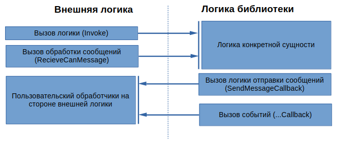

# CANFileTransferProtocol

---
## Описание протокола

**CANFileTransferProtocol** - протокол прикладного уровня, построенный на базе CAN-протокола, предназначенный для передачи файлов. Протокол предполагает наличия одного ведущего (источника файлов, сервера) и произвольного числа ведомых (приемников файлов, клиентов). Передача файлов осуществляется поблочно (фрагментами файла) с верификацией получения блока каждым из клиентов. В случае возникновения ошибок передачи, сессия передачи файла будет продолжена для оставшихся в сессии клиентов.

---
## Концептуальные особенности протокола

- Максимальное количество одновременных сессий передачи файлов - 256.
- Максимальное число участиков сессии (клиентов) - 256.
- Максимальный размер передаваемого блока файла - 2048 байт.
- Максимальный размер файла - 2^32 байт.

 > **Примечание.** Представленные значения являются алгоритмическими, фактические ограничения зависят от технических характеристик аппаратных средств и от пропускной способности CAN-шины. 

---
## Составные части протокола и их описания

### Этап поиска устройств


#### Описание этапа

1) При первоначальном поиске устройств (клиентов), реализующих описываемый протокол, происходит циклическая отправка сообщений **Ping**, на которые клиенты отвечают группами сообщений **PingResponse**, передающими описание устройства.

2) В случае, если сервер ответил подтверждениями (**ResponseAck**) на все сообщения **PingResponse**, клиент прекращают отвечать на сообщение **Ping**.

3) Для блокировки логики клиента (кроме протокола) необходимо отправить сообщение **Ping** с флагом **TERMINATE**, для включения логики - с флагом **RELEASE**; стоит отметить, что отправка данного сообщения с флагом **RELEASE** автоматически прекратит работу активной сессии передачи файла.

> **Примечание**. Сообщения ответов со стороны клиентов передаются со случайным периодом в заданном диапазоне.

> [CAN-матрица протокола](./Docs/CAN-Matrix.md)

### Этап управления сессией передачи файла


#### Описание этапа

1) Сообщение **Registration** (обезличенное) сообщает клиенту код сессии и его код в рамках сессии передачи файла.

2) Остальные сообщения этапа **Session** передаются уже с привязкой к конкретному коду сессии.

3) Сообщение **SessionConfig** передает клиентам необходимую информацию для реализации сессии.

4) Сообщение **StartSession** оповещает клиентов о готовности начать последовательность блоков файла.

5) Сообщение **FinishSession** сообщает клиентам, что сессия завершена. В случае аварийной остановки сессии в произвольный момент времени также отправляется сообщение **FinishSession**. Данное сообщение содержит статус сессии, который сообщает об успешности ее завершения, или тип возникшей ошибки.

6) Сообщение **DeleteClient** отправляется в случае возникновения ошибки с конкретным клиентом во время сессии, чтобы освободить его, в то время как сессия будет продолжена для оставшихся клиентов. Данное сообщение является опциональным.

> [CAN-матрица протокола](./Docs/CAN-Matrix.md)

### Этап управления передачей блока файла


#### Описание этапа

1) Сообщение **StartBlock** оповещает всех участников сессии о начале передачи блока, и сообщает индекс и размер передаваемого блока.

2) Сообщения **DataFrame** содержат фрагменты блока из 8 байт (до 256 сообщений).

3) Сообщения **FinishBlock** оповещает об окончании передачи блока.

4) В случае, если на стороне клиента был получен не весь блок, им высылается сообщение **SubBlocksStatuses**, которое содержит флаги получения субблоков (группы по 4 **DataFrame**), в случае, если все **DataFrame** были получены, отправляется сообщение **BlockCRC**.

5) Если на стороне сервера было получено сообщение **SubBlocksStatuses**, то после отправки сообщения **FinishBlockAck**, будет осуществлена повторная отправка “пропущенных” субблоков; в случае, если было получено сообщение **BlockCRC**, и контрольные суммы не совпали, то будет повторно отправлен весь блок. В обоих случаях сервер отвечает сообщением **BlockFeedbackAck**.

6) Сообщение **FinishBlockAck** необходимо для подтверждения звершения процесса обработки блока на стороне клинета (например, загрузки во Flash-память).

7) Если все клиенты выслали корректные CRC-суммы и были подтверждено получения всех субблоков, происходит отправка следующего блока, в противном случае, происходит отправка недоставющих фрагментов предыдущего блока, или всего блока целиком.

> [CAN-матрица протокола](./Docs/CAN-Matrix.md)

---
## Программная реализация протокола

В данном проекте приводится реализация изложенного протокола в виде независимой библиотеки, написанной на языке **C**, использующая механизмы обработных вызовов и функционального API для обеспечения сопряжение со внешней логикой.

Используется 5 абстратных сущностей прикладного уровня:

- **CanFTP_Client_t** - клиент на стороне конечного устройства-участника.

- **CanFTP_Server_t** - сервер, реализующий логику поиска устройств-клиентов для осуществления передачи файлов. 

- **CanFTP_Server_Client_t** - клиент на стороне сервера, являющийся проекцией физического устройства.

- **CanFTP_Server_Session_t** - сессия передачи файла устройствам-клиентам.

- **CanFTP_Server_Session_Client_t** - клиент сессии на стороне сервера.

Для реализации логик соответсвующих абстракций необходимо циклически вызывать функции **Invoke**, а для обработки получаемых сообщений - **RecieveCanMessage**. Для обработки CAN-сообщений используется внутренняя структура **CanFTP_CanMessage_t**.

> Для детального ознакомления со структурой CAN-сообщения см. файл **/source/messages/CanFTP_CanMessage.h**.



Стоит отдельно отметить, что при передаче файла обработка осуществляется исключительно поблочно, таким образом, на стороне сервера при необходимости передачи нового блока файла происходит обратный вызов для его инициализации, а на стороне клиента - возникает событие получения нового блока с целью его последующей обработки, иными словами, библиотека не производит хранение всего файла целиком ни на стороне клиента, ни на стороне сервара, перекладывая данную задачу вышестоящей логике.

Для обеспечения корректной роботы логики библиотеки необходимо провести инициализацию функции получения текущего времени, время измеряется в **мс**.

```C
CanFTP_TimeMark_t GetTimeMark()
{
    // Какой-то источник времени (в мс)
    return currentTime;
}
// Инициализация геттера
CanFTP_TimeHandlers_InitCurrentTimeGetter(GetTimeMark);
```

> Для детального ознакомления с обработчиками времени см. файл **/source/base/CanFTP_TimeHandlers.h**.

> Можно изменить базовый тип **CanFTP_TimeMark_t** в случае, если не будет хватать диапазона 32 бит для измерения времени.

Также, библиотека отслеживает собственное аномальное поведение, для обеспечения сигнализации можно произвести инициализацию соответствующего обработчика.

```C
void ErrorHandle(uint32_t errorCode)
{
    // Какая-то реализация обработчика возникновения аномального поведения
}

// Инициализация обработчика
CanFTP_InitErrorHandler(ErrorHandle);
```

> Для детального ознакомления с обработчиком ошибок см. файл **/source/base/CanFTP_ErrorHandlers.h**.

В случае, если необходимо уменьшить буфер блока файла, необходимо скорректировать константу **CANFTP_FILEBLOCK_LENGTH** (по умолчанию - 2048) в файле **/source/session/CanFTP_Session_FileBlock_Defines**

> [Описание сущностей прикладного уровня](./Docs/Entities.md)

> [Примеры кода](./Docs/CodeExamples.md)

## Сборка и подключение проекта

Проект создан для сборки с помощью CMake, что позволяет подключить его как submodule и осуществлять его сборку в рамках вышестоящего проекта.
